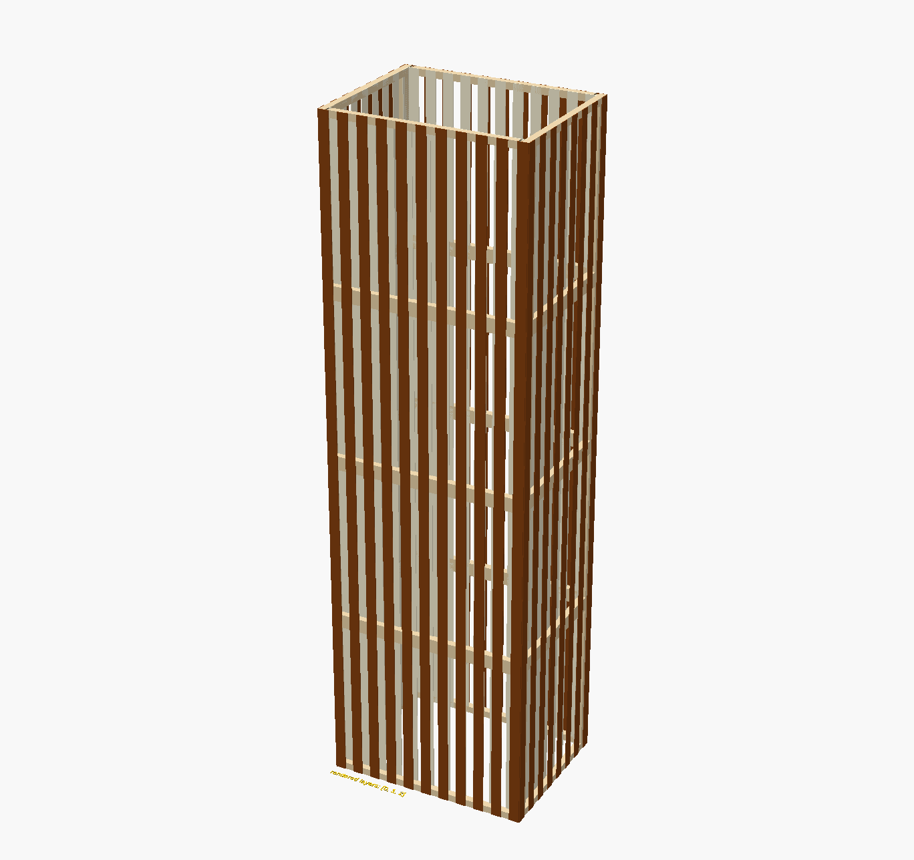

# OpenSCAD Cutter Lib

Parametric OpenSCAD helpers for designing assemblies that can be viewed in 3D
and laid out as 2D parts for cutting.

The library supplies layout and assembly logic for boxes, frames, arrays,
layered walls, repeated floors, connectors, struts, slots, and reference
surfaces. A complete four-level lamp in [`project/lamp`](project/lamp) shows
how the pieces fit together.

The repository also includes a fabrication-oriented
[Bob countertop dishwasher miniature](project/bob_dishwasher) with a moving
pin-hinged door, rib-supported veneer shell, removable rack, calibrated hidden
joints, and plywood/veneer sheet layouts.



## What the library does

The central idea is to define a part once and pass it to an arrangement module
as a child. The arrangement module then either:

- positions and rotates the parts into an assembled model when `make_3d=true`;
- places the same parts flat when `make_3d=false`.

This is useful for checking an assembly in OpenSCAD before exporting its
individual panels to SVG or DXF.

The repository currently provides:

| Area | Capabilities |
| --- | --- |
| Shapes | Six-face box layouts, four-part frames, repeated arrays, padding |
| Construction | Layer visibility, test surfaces, 45-degree connectors and struts |
| Towers | Layered walls, six-sided floors, vertically repeated floors |
| Marking | Repeated ruler ticks |
| Example project | A configurable, multi-level wooden lamp |
| Appliance project | Parametric Bob dishwasher miniature and cutting sheets |

See the [API reference](docs/API.md) for module signatures, child ordering,
return values, and constraints.

## Requirements

- OpenSCAD 2021.01
- Git, if cloning the repository
- Python 3 for composite operation-colour SVG exports

There are no external OpenSCAD library dependencies. OpenSCAD 2021.01 is the
tested compatibility baseline used by continuous integration.

## Getting started

Clone the project:

```sh
git clone https://github.com/eMaxDH/OpenSCAD-Cutter-Lib.git
cd OpenSCAD-Cutter-Lib
```

Open `project/lamp/lamp.scad` in OpenSCAD to inspect the example. Change
`make_3d` near the top of that file:

```scad
make_3d = true;  // assembled preview
// make_3d = false; // flat cutter layout
```

From a terminal, the equivalent exports are:

```sh
openscad -o lamp.stl -D 'make_3d=true' project/lamp/lamp.scad
openscad -o lamp.svg -D 'make_3d=false' project/lamp/lamp.scad
```

OpenSCAD's `-D` option overrides the values in the source file. Use a 3D
output format for assembled geometry and a 2D output format for flat geometry.

## Minimal example

The following model uses the same six panels for an assembled box and a flat
layout. Save it in the repository root so the import paths resolve:

```scad
use <cutter_lib/shapes/cshape_box.scad>

make_3d = true;

width = 80;
height = 50;
depth = 40;
thickness = 3;
spacing_2d = 2;

face_sizes =
    get_cshape_box_face_size_move(width, height, depth, thickness);

module panel(size, thickness, make_3d) {
    if (make_3d)
        cube([size[0], size[1], thickness]);
    else
        square(size);
}

cshape_box_arrange_move(
    width,
    height,
    depth,
    thickness=thickness,
    make_3d=make_3d,
    spacing_2d=spacing_2d
) {
    panel(face_sizes[0], thickness, make_3d); // top
    panel(face_sizes[1], thickness, make_3d); // back
    panel(face_sizes[2], thickness, make_3d); // left
    panel(face_sizes[3], thickness, make_3d); // bottom
    panel(face_sizes[4], thickness, make_3d); // right
    panel(face_sizes[5], thickness, make_3d); // front
}
```

Child order is part of the API. Box layouts always expect:

```text
0 top, 1 back, 2 left, 3 bottom, 4 right, 5 front
```

The layout modules transform their children but do not generate joinery,
kerf compensation, or tool paths automatically. Put those details into the
child panel geometry.

## Importing the library

Use OpenSCAD's `use` directive:

```scad
use <cutter_lib/shapes/cshape_frame.scad>
use <cutter_lib/strut/cs_strut_triangle_45.scad>
```

Do not use `include` for normal library consumption. Most source files contain
an executable demonstration at file scope; `use` imports only modules and
functions and prevents those demonstrations from appearing in your model.

Paths are resolved relative to the file containing the import. If the library
is installed in an OpenSCAD library directory, the shorter installed-library
path may be used instead.

## Core conventions

### Dimensions

OpenSCAD itself treats dimensions as unitless. This repository's documented
dimensions and manufacturing interfaces use millimetres.

`width` maps to X, `depth` to Y, and assembled `height` to Z. Flat layouts lie
in the XY plane.

### 2D and 3D modes

Most public modules accept `make_3d=false`. When it is false, children should
produce 2D geometry. When it is true, children should produce geometry whose
material thickness extends along local Z.

`spacing_2d` separates flat parts. It is layout spacing, not laser kerf.

### Layers

Layer-aware modules accept a layer number and a list named
`visible_layers`. If the list is empty, all layers render. If it is non-empty,
listed layers render normally and other layers become OpenSCAD background
geometry (`%`).

The pre-1.0 spelling cleanup renamed the historical `visibile_layers` argument
to `visible_layers`. This is intentionally breaking; see
[`docs/API_MIGRATION_V1.md`](docs/API_MIGRATION_V1.md).

### Naming

Prefixes indicate the component family:

- `cshape_*`: shape and layout utilities
- `ct_tower_*`: tower, floor, and wall utilities
- `cs_*`: surfaces, struts, and slots
- `cc_*`: connectors
- `cl_*`: layer helpers
- `cm_*`: markers

The pre-1.0 spelling cleanup renamed `element_hight` to `element_height` and
fixed the element-height-only sizing branch.

## Repository layout

```text
cutter_lib/
  connector/   45-degree male/female connector geometry
  layer/       layer visibility helpers
  marker/      ruler/tick markers
  shapes/      arrays, boxes, frames, and padding
  slot/        elongated 2D holes
  strut/       connector-ended struts with optional holes
  surfaces/    numbered diagnostic surfaces
  tower/       walls, floors, and vertical stacking
project/
  lamp/        complete example and exported images/models
  bob_dishwasher/
               miniature appliance assembly and cutting layouts
docs/
  API.md       module and function reference
  LAMP.md      example-project walkthrough
  *_STANDARD.md
               governed design, Customizer, manufacturing, and export rules
templates/
  component/   canonical 2D/3D component starting point
  assembly/    configurable assembly, layout, and acceptance-test example
tests/         governed file inventory and OpenSCAD acceptance checks
scripts/       SVG/LightBurn export helpers
```

## Example project

The lamp composes the library at three levels:

1. struts and repeated slats form a layered wall;
2. six wall positions form a floor;
3. four floors are stacked into the lamp.

Read the [lamp walkthrough](docs/LAMP.md) before modifying its dimensions or
exporting individual layers.

For a manufacturing-focused example, read the
[Bob project guide](project/bob_dishwasher/README.md).

## Starting a new component or assembly

Copy the closest directory under [`templates/`](templates), rename its `tpl_`
symbols, and register each new entry file in
[`tests/public_files.txt`](tests/public_files.txt). The governing geometry and
Customizer rules are in the [design standard](docs/DESIGN_STANDARD.md) and
[Customizer standard](docs/CUSTOMIZER_STANDARD.md).

For operation-specific and LightBurn-ready SVG files:

```sh
scripts/export_lightburn_svg.sh \
  project/bob_dishwasher/bob_dishwasher.scad \
  /tmp/bob_veneer cut,engrave \
  -D 'layout_material="veneer"'
```

This produces authoritative `_cut.svg` and `_engrave.svg` files plus a
colour-classified `_all.svg` convenience file.

## Tests and governance

```sh
tests/governance.sh
tests/render_examples.sh
tests/array_acceptance.sh
tests/lamp_acceptance.sh
tests/export_acceptance.sh
tests/bob_acceptance.sh
```

The project uses maintainer-led governance, a declared public-file inventory,
Architecture Decision Records, and GitHub Actions. See
[`GOVERNANCE.md`](GOVERNANCE.md) and [`CONTRIBUTING.md`](CONTRIBUTING.md).

## Current limitations

- There is no tagged package or central include file; import the required
  `.scad` files directly.
- The pre-1.0 API cleanup is intentionally breaking; update named arguments as
  described in `docs/API_MIGRATION_V1.md`.
- Fit and kerf must still be calibrated for the actual material and machine.
- Separate operation SVGs are authoritative because OpenSCAD 2021.01 does not
  provide a portable SVG layer contract.

## License

OpenSCAD Cutter Lib is distributed under the [MIT License](LICENSE).
