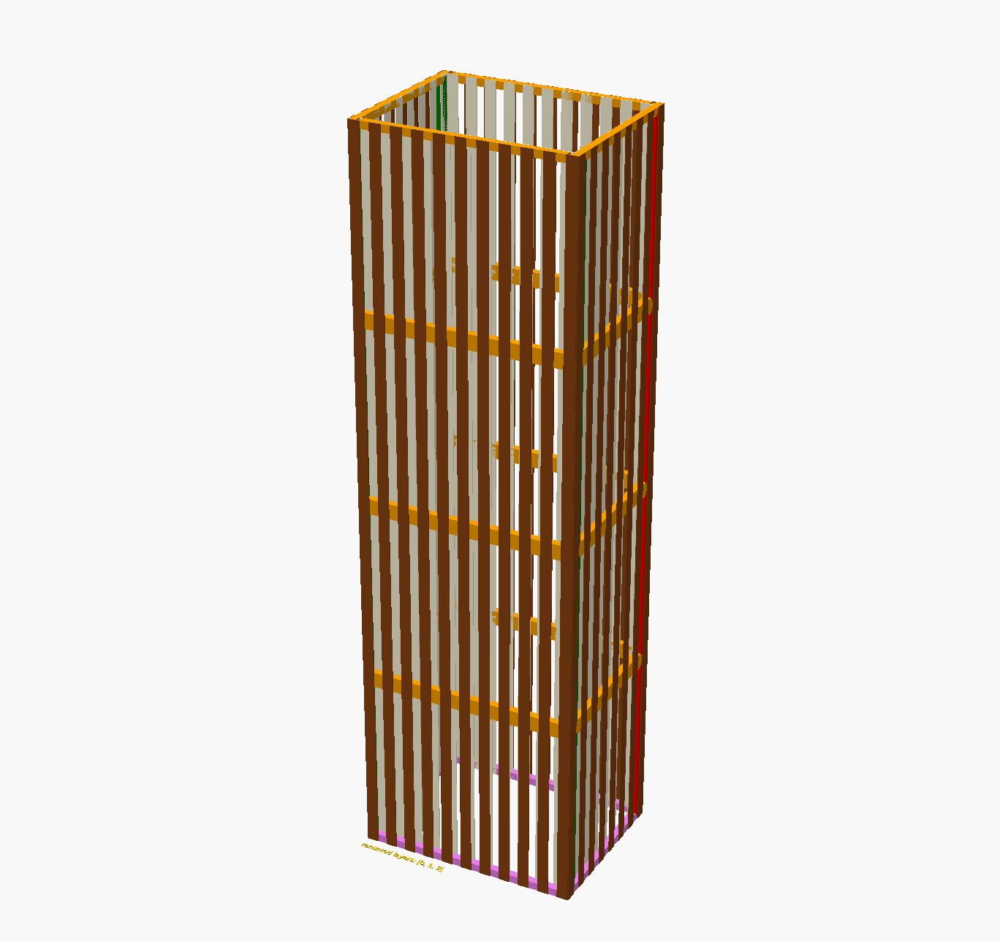

# Lamp example

`project/lamp` is the repository's end-to-end example. It demonstrates how a
single parametric model can serve as both an assembled preview and a source of
flat parts.



## Files

| File | Role |
| --- | --- |
| `lamp.scad` | Top-level four-floor lamp |
| `lamp_floor.scad` | Builds the basement, middle, and top floor variants |
| `lamp_wall.scad` | Builds frame, front slats, and back slats for one wall |
| `lamp.json` | Saved OpenSCAD parameter set; contains older parameter names |
| `lamp_floor.json` | Saved floor parameter set; contains older parameter names |
| `img/` | Checked-in previews and sample STL/SVG exports |

## Composition

The model is assembled from nested child layouts:

```text
lamp
└── ct_tower_arrange
    ├── lamp_floor_basement
    ├── lamp_floor_middle_part
    ├── lamp_floor_middle_part
    └── lamp_floor_top
        └── ct_tower_floor_arrange
            ├── top
            ├── back wall
            ├── left wall
            ├── bottom
            ├── right wall
            └── front wall
                └── ct_tower_wall_arrange
                    ├── four frame struts
                    ├── front slats
                    └── back slats
```

The wall slats are repeated with `cshape_array_repeat`. Frame and slat parts
use `cs_strut_triangle_45`, so their 2D profile can include connector ends and
paired circular or elongated mounting holes.

## Main controls

The active controls are near the top of `lamp.scad`:

```scad
make_3d = true;
floor_size = [294, 244, 228];
frame_width = 10;
wall_depth = 4;
visibile_layers = [0, 1, 2];
spacing_2d = 1;
use_construction_color = true;
```

`floor_size` is passed to the lamp as:

```text
[width, depth, height]
```

The lamp contains four levels, so its nominal total height is four times
`floor_size[2]`.

`wall_depth` is the material thickness used by the box and wall arrangements.
`frame_width` is the visible width of the perimeter frame.

## Preview modes

For an assembled preview:

```sh
openscad -o lamp.stl -D 'make_3d=true' project/lamp/lamp.scad
```

For all layers in a flat layout:

```sh
openscad -o lamp.svg \
  -D 'make_3d=false' \
  -D 'visibile_layers=[0,1,2]' \
  project/lamp/lamp.scad
```

The construction colours distinguish facing direction and frame components.
Set `use_construction_color=false` for the material-style colour scheme used
by the regular lamp preview.

## Layer exports

The lamp convention is:

| Layer | Contents |
| ---: | --- |
| 0 | Perimeter frame |
| 1 | Front-facing slats |
| 2 | Back-facing slats |

`apply_cl_layer_visibility` turns unselected layers into OpenSCAD background
geometry. Check the generated 2D result before fabrication to ensure the
chosen output backend excludes background geometry as expected.

Example layer previews:

```sh
openscad -o lamp-layer-0.svg \
  -D 'make_3d=false' \
  -D 'visibile_layers=[0]' \
  project/lamp/lamp.scad

openscad -o lamp-layer-1.svg \
  -D 'make_3d=false' \
  -D 'visibile_layers=[1]' \
  project/lamp/lamp.scad

openscad -o lamp-layer-2.svg \
  -D 'make_3d=false' \
  -D 'visibile_layers=[2]' \
  project/lamp/lamp.scad
```

## Changing dimensions safely

The example contains some hole distances tailored to its default dimensions:

- front and back walls use a `267` distance;
- left and right walls use a `217` distance;
- the hole radius is commonly `1.5` and the elongated-hole length is `5`.

These values appear in `lamp_floor.scad`. Changing `floor_size`,
`frame_width`, or `wall_depth` does not automatically recalculate every hole
distance. After a size change:

1. inspect each wall in assembled 3D;
2. verify that connectors meet at every corner;
3. verify that both holes remain inside every strut;
4. switch to 2D and check for overlaps;
5. add material-specific kerf and fit compensation before cutting.

The front and back slat counts are derived by
`get_lamp_wall_element_no(width, element_width, ratio)`. The default lamp uses
a ratio of `1.618` and a nominal element width of `15`.

## Saved parameter sets

The JSON parameter sets refer to `wall_thickness`, while the current SCAD
sources use `wall_depth` and `frame_width`. They may still be useful as a
record of earlier settings, but they should not be treated as a reliable
source of current parameters. Prefer command-line `-D` values or edit the
SCAD controls directly.

## Fabrication note

The checked-in SVG and STL files are examples, not guaranteed manufacturing
outputs. This repository does not encode a machine profile, kerf, material
tolerance, grain direction, sheet size, or safety validation. Verify all
dimensions and regenerate the files for the intended process.

