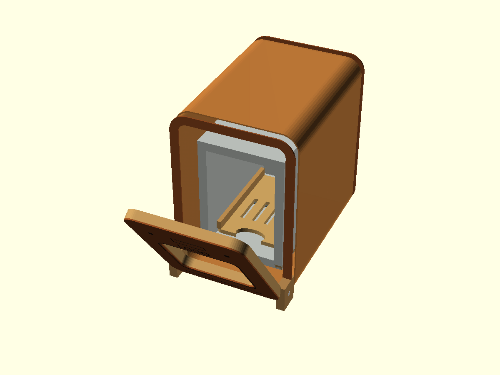

# Bob countertop dishwasher scale model

This project is a parametric, laser-cut miniature inspired by the proportions
and recognisable front appearance of the Bob countertop dishwasher. It uses a
4 mm plywood rib cage, a single-direction veneer shell, glued hidden joints,
and a simple purchased pin.

It is a fabrication-oriented approximation, not a scan-derived replica.
Compound production-plastic curves are represented by a constant rounded
cross-section that veneer can realistically wrap.



## Reference size and scale

| Dimension | Source | 80 mm model |
| --- | ---: | ---: |
| Width | 340 mm | 55.51 mm |
| Height | 490 mm | 80.00 mm |
| Depth | 490 mm | 80.00 mm |

The default scale is approximately 1:6.125. `model_width` and `model_depth`
are always derived from `model_height`.

## Materials and hardware

- 4 mm plywood for ribs, frames, base, chamber, door structure, hinge cheeks,
  stringers, rack, and runners
- approximately 0.6 mm wood veneer for the wrap and cosmetic faces
- wood glue
- a 2 mm rod, wire, dowel, or similarly sized pin for the hinge
- paint or clear finish as desired

The nominal `kerf=0.5` mm is provisional. It must be calibrated for the exact
material, focus, power, speed, and machine condition.

## Main parameters

Open `bob_dishwasher.scad` to edit these values in OpenSCAD's Customizer, or
override them with `-D` options. `bob_config.scad` mirrors the defaults as a
standalone configuration reference, but the main file owns the active
Customizer controls.

```scad
model_height = 80;
plywood_thickness = 4;
veneer_thickness = 0.6;
kerf = 0.5;
fit_clearance = 0.15;

sheet_size = [300, 300];
sheet_margin = 5;
part_spacing = 3;

door_angle = 90;
hinge_pin_diameter = 2;
hinge_clearance = 0.2;
hinge_axis_offset = 2.5;

shell_rib_count = 4;
window_mode = "open";
rack_enabled = true;
rack_pullout = 0;
show_veneer = true;
show_rib_cage = true;
veneer_opacity = 0.58;

make_3d = true;
output_mode = "automatic";
layout_material = "all";
layout_operation = "preview";
```

In OpenSCAD's Customizer, leave `output_mode="automatic"` to use the
`make_3d` checkbox:

- checked: assembled 3D model;
- unchecked: flat cutting layout.

The saved `bob_dishwasher.json` presets provide default assembly, cutting
layout, and skeleton-inspection configurations.

If the panel is hidden, enable the **Customizer** panel from OpenSCAD's
Window/View menu, then save or select a parameter set from the panel.

The validated door range is 0–90 degrees. Positive motion opens the door
outward and downward. The axis is shifted forward from the shell to clear the
lower frame, chamber floor, and veneer.

## Output modes

Run commands from the repository root.

Assembled model:

```sh
openscad -o bob.csg \
  -D 'output_mode="assembly"' \
  project/bob_dishwasher/bob_dishwasher.scad
```

Open door at 45 degrees:

```sh
openscad -o bob-45deg.csg \
  -D 'output_mode="assembly"' \
  -D 'door_angle=45' \
  project/bob_dishwasher/bob_dishwasher.scad
```

All cutting sheets:

```sh
openscad -o bob-layout.svg \
  -D 'output_mode="cut_layout"' \
  -D 'layout_material="all"' \
  -D 'layout_operation="cut"' \
  project/bob_dishwasher/bob_dishwasher.scad
```

The composite layout places two plywood sheets and one veneer sheet side by
side. Export individual sheets at the origin for machine preparation:

```sh
openscad -o bob-plywood-1.svg \
  -D 'output_mode="cut_layout"' \
  -D 'layout_material="plywood_1"' \
  -D 'layout_operation="cut"' \
  project/bob_dishwasher/bob_dishwasher.scad

openscad -o bob-plywood-2.svg \
  -D 'output_mode="cut_layout"' \
  -D 'layout_material="plywood_2"' \
  -D 'layout_operation="cut"' \
  project/bob_dishwasher/bob_dishwasher.scad

openscad -o bob-veneer.svg \
  -D 'output_mode="cut_layout"' \
  -D 'layout_material="veneer"' \
  -D 'layout_operation="cut"' \
  project/bob_dishwasher/bob_dishwasher.scad
```

Other modes are `exploded`, `debug`, `calibration`, and `single_part`.
`debug` adds the nominal envelope, hinge reference, and sampled door sweep.
`single_part` supports `BOB-DOOR-FRAME`, `BOB-RIB-01`, and `BOB-CAL-01`.
Set `show_veneer=false` and `show_rib_cage=true` for structural inspection.

Every Bob `.scad` file can also be opened directly. `bob_body.scad`,
`bob_door.scad`, `bob_chamber.scad`, `bob_rack.scad`, and `bob_layout.scad`
contain standalone 2D/3D examples; `bob_config.scad` shows the configured
outer envelope.

## Complete flat part manifest

The Bob entry module follows the lamp convention: `make_3d=true` assembles
the model, while `make_3d=false` sends the manufactured components to
deterministic XY sheet positions. No cut part remains rotated out of plane.

The default plywood set contains 25 pieces:

| Part | Quantity |
| --- | ---: |
| Front frame | 1 |
| Internal shell ribs | 4 |
| Rear frame | 1 |
| Longitudinal stringers | 4 |
| Hidden base | 1 |
| Door frame | 1 |
| Hinge cheeks | 2 |
| Chamber rear, floor, and top | 3 |
| Chamber sides | 2 |
| Rack base | 1 |
| Chamber tray runners | 2 |
| Removable-rack side rails | 2 |
| Calibration coupon | 1 |

The veneer sheet contains four pieces: the main wrap, door fascia, front
termination frame, and rear face. The hinge pin is purchased hardware and is
therefore reported in the manifest but is not a laser-cut part.

### Geometry source rule

Every rigid manufactured Bob part has one canonical 2D profile. The 3D
assembly positions, rotates, and extrudes that same module; it does not redraw
the part as an unrelated cube or polygon. Kerf compensation is enabled for
laser-export geometry and disabled for the physical 3D preview, while fit
clearance remains represented.

The veneer wrap is the intentional exception to literal extrusion: its flat
rectangular development is bent around the same constant rounded
cross-section used by the 3D shell. The transparent window insert, hinge pin,
and engraving previews are not laser-cut structural parts.

## Cut and engrave operations

Set `layout_operation="preview"` to inspect both operations:

- red is cutting geometry;
- blue is engraving geometry;
- grey/background geometry is a sheet boundary, identifier, or orientation
  arrow and should not be manufactured.

The 2D preview reports the active material and operation in both the OpenSCAD
console and an on-canvas legend. If only one part is visible, check whether
`layout_material="veneer"` and `layout_operation="engrave"` are selected:
that filter intentionally shows only the engraved door fascia. Select
`layout_material="all"` and `layout_operation="preview"` to see every sheet
and operation. Because the three sheets span much farther than the assembled
model, use OpenSCAD's **View All / Zoom to fit** command after changing to 2D.

The door fascia includes the display outline, controls, logo placeholder,
window seam, lower panel seam, and vent grille. OpenSCAD SVG export does not
reliably preserve preview colours, so produce separate files at matching
coordinates:

```sh
openscad -o bob-veneer-cut.svg \
  -D 'output_mode="cut_layout"' \
  -D 'layout_material="veneer"' \
  -D 'layout_operation="cut"' \
  project/bob_dishwasher/bob_dishwasher.scad

openscad -o bob-veneer-engrave.svg \
  -D 'output_mode="cut_layout"' \
  -D 'layout_material="veneer"' \
  -D 'layout_operation="engrave"' \
  project/bob_dishwasher/bob_dishwasher.scad
```

The chamber spray-arm engraving is registered to the chamber floor on
plywood sheet 2:

```sh
openscad -o bob-plywood-2-engrave.svg \
  -D 'output_mode="cut_layout"' \
  -D 'layout_material="plywood_2"' \
  -D 'layout_operation="engrave"' \
  project/bob_dishwasher/bob_dishwasher.scad
```

Import both without changing their origin and assign the appropriate machine
operation in the laser software.

## Calibration procedure

```sh
openscad -o bob-calibration.svg \
  -D 'output_mode="calibration"' \
  project/bob_dishwasher/bob_dishwasher.scad
```

The coupon supplies slot and pin-hole samples at:

```text
-0.20, -0.10, 0.00, +0.10, +0.20, +0.30 mm
```

1. Cut it from the same plywood and with the same machine setup.
2. Measure the cut width if possible.
3. Test scrap plywood in every slot without forcing it.
4. Test the intended hinge pin in every hole.
5. Choose a glue-fit clearance and a freely rotating pin clearance.
6. Update `kerf`, `fit_clearance`, and `hinge_clearance`.
7. Regenerate the cutting sheets.

There is no universal best clearance. Grain, glue, humidity, and machine
settings affect the result.

## Veneer

The main skin bends around the side/top/bottom cross-section and stays
straight along depth. This is the expected grain/bending direction. Do not
stretch it into a compound curve.

The flattened wrap uses straight sides and top plus two quarter-circle corner
transitions. It is a practical constant-cross-section development. The
default 8 mm radius is checked against a 5 mm recommended minimum, but the
selected veneer still needs a physical bend test. A front veneer ring and rear
veneer face terminate the wrap.

## Suggested assembly order

1. Cut and evaluate the calibration coupon.
2. Dry-fit the front frame, four internal ribs, rear frame, and four
   longitudinal stringers.
3. Glue the rib cage square on the hidden base.
4. Assemble the chamber floor, top, rear, and sides with the hidden tabs and
   slots, then install it inside the cage.
5. Glue the tray runners inside the chamber.
6. Assemble and test the removable tray-style rack.
7. Laminate the door fascia onto its plywood frame, keeping the window open.
8. Glue the hinge cheeks to the internal front supports.
9. Align the door/support holes and insert the purchased pin.
10. Test the door at 0, 45, and 90 degrees before adding cosmetic parts.
11. Pre-form and glue the veneer wrap over the ribs.
12. Add the front termination ring and rear veneer face.
13. Sand lightly, mask moving areas, and paint or finish.

Do not glue the rack. Pull it through the open door or lift it from its
runners. Keep paint, glue, and finish out of pin holes and runners.

## Window and chamber

`window_mode="open"` leaves the aperture empty. The optional
`"transparent_insert"` mode adds a preview insert, but no transparent sheet is
included in the cutting layout.

The box-like chamber contains only structural panels, ledges, and a simplified
spray-arm mark. There is no tank, pump, plumbing, heater, lighting, or rear
service compartment.

## Validation

The model warns outside the initially recommended 70–160 mm height range. The
deterministic layouts are exercised at 70, 80, and 100 mm. Larger models may
need more sheets even if their assembly geometry remains valid.

```sh
tests/bob_acceptance.sh
```

The script covers three heights, door angles 0/45/90, kerf values 0.15/0.5,
assembly layouts, and calibration output.

## Known limitations

- The exterior uses supplied envelope proportions and visual interpretation,
  not measured scan data.
- The constant cross-section omits subtle front-to-back compound curvature.
- Physical hinge play and veneer spring-back still require a dry fit.
- The deterministic layout expects four internal ribs.
- Transparent-window mode is preview-only.
- Labels and orientation arrows are reference geometry, not engraving.
- Kerf, fit, pin clearance, and bend radius require physical calibration.
- This decorative miniature is not waterproof, food-safe, or child-safety
  certified.
